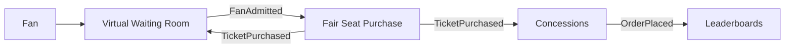

# Architecture

> See also: [Domain Model](domain-model.md) | [DynamoDB Handbook](dynamodb-handbook.md) | [Infrastructure Standards](infrastructure-standards.md) | [Roadmap](roadmap.md)

## Intent

The repository is structured as a production-grade platform composed of independently deployable modules:

- Each module is a bounded context with independent DynamoDB design, Lambdas, and tests.
- The root platform connects modules through a shared EventBridge bus and consistent vocabulary.
- Documentation explains both the standalone module design and the multi-module platform architecture.

## High-Level Flow



## Backend Shape

| Layer | Choice | Reason |
|---|---|---|
| Compute | AWS Lambda | Stateless handlers fit bursty event traffic |
| API | API Gateway REST APIs | Simple public surface per module |
| Database | DynamoDB table per module | Keeps bounded contexts independent while preserving single-table design locally |
| Events | EventBridge custom bus | Decouples modules and supports at-least-once delivery |
| IaC | AWS SAM nested stacks | One platform deploy, independent module templates |

## Module Boundaries

### Waiting Room

Owns fan admission. It records who joined, the assigned queue position, admission status, and admission token lifecycle. It does not know seat inventory.

### Seat Purchase

Owns seat inventory and purchase correctness. It verifies admission, holds seats conditionally, confirms purchases transactionally, and emits completion events.

### Concessions

Owns menu, stand assignment, inventory management, and order fulfillment. Routes orders to the nearest stand with available stock. Serves FIFO queues to operators with VIP priority via lexicographical sort key design.

### Leaderboard

Owns score ingestion and ranking views. Uses a 16-shard write model for extreme concurrency. Computes Top-N and exact rank via scatter-gather queries across all shards.

## DynamoDB Strategy

The default is one single-table design per module. This avoids forcing unrelated access patterns into one global table while still demonstrating DynamoDB modeling depth inside each bounded context.

Each table design must document:

- Entity types and key shapes.
- Every access pattern and index used.
- Conditional writes and transaction boundaries.
- Hot partition risks and sharding strategy.
- TTL usage and its consistency trade-offs.

## Event Strategy

Events describe facts that already happened. They are not commands.

Example:

```json
{
  "source": "global-sporting-event.waiting-room",
  "detail-type": "FanAdmitted",
  "detail": {
    "eventId": "match-001",
    "fanId": "fan-123",
    "tokenId": "token-abc",
    "admittedAt": "2026-07-28T10:00:00Z"
  }
}
```

Consumers must be idempotent because EventBridge delivers at least once.

## Known Architectural Risks

| Risk | Why It Matters | Direction | Status |
|---|---|---|---|
| Waiting room admission is still operator/API-triggered | A production waiting room should refill capacity automatically | Add scheduled or event-driven admission controller | Open |
| Queue position uses service-side Lambda time | Fair enough for modeling, but not a total global ordering oracle | Document tie-breaking and consider arrival-window sequencer if needed | Documented |
| Fan polling can become expensive at very high frequency | Millions polling status every second creates read pressure | Add caching/backoff/WebSocket strategy after correctness is proven | Open |
| Seat-purchase token validation adds network hop | HTTP call to waiting-room API adds ~50-100ms latency | Acceptable for one-time session creation; not on hot path | Accepted |


